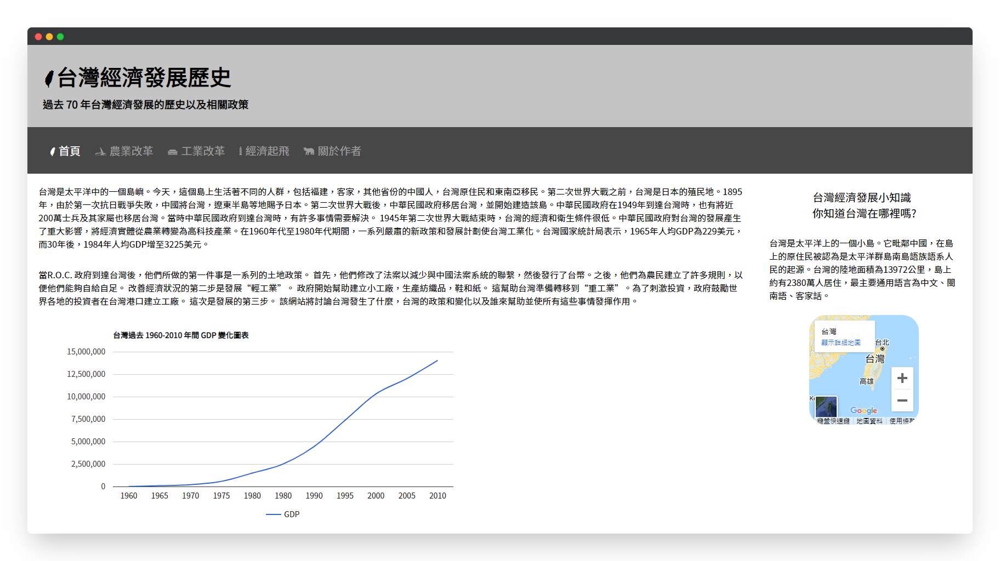
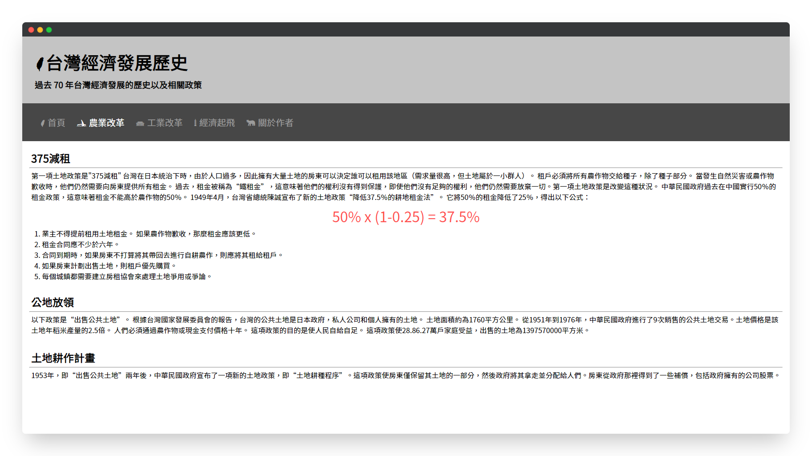
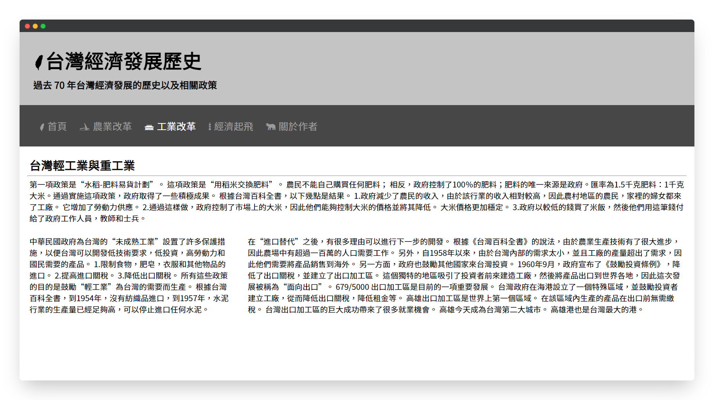
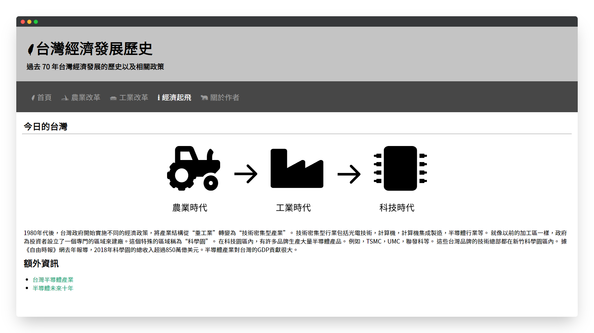
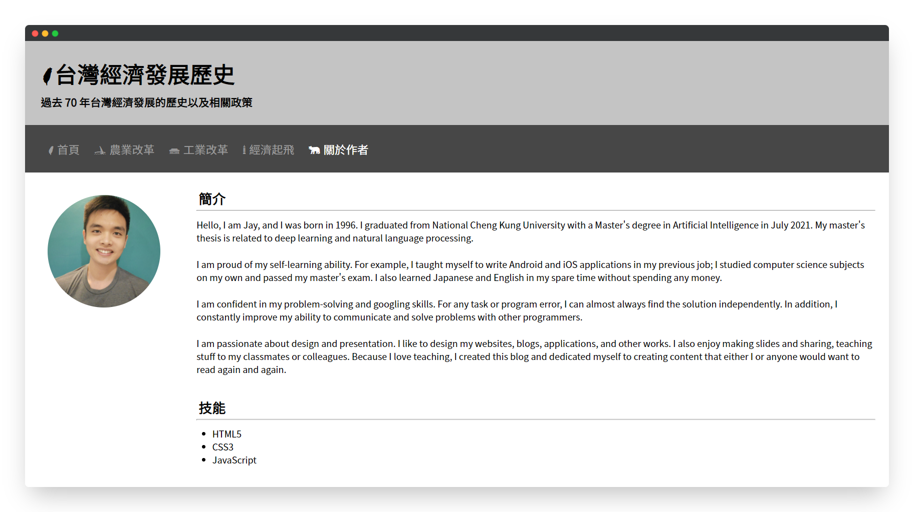
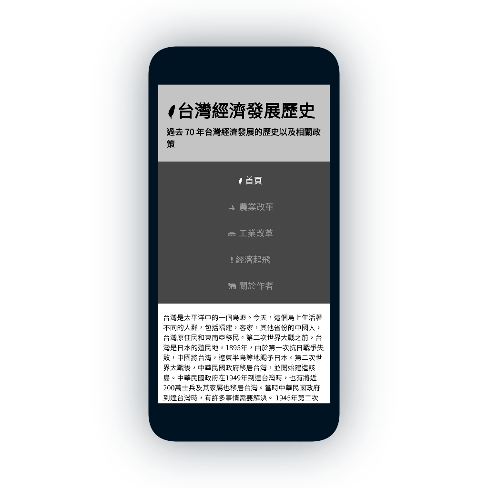
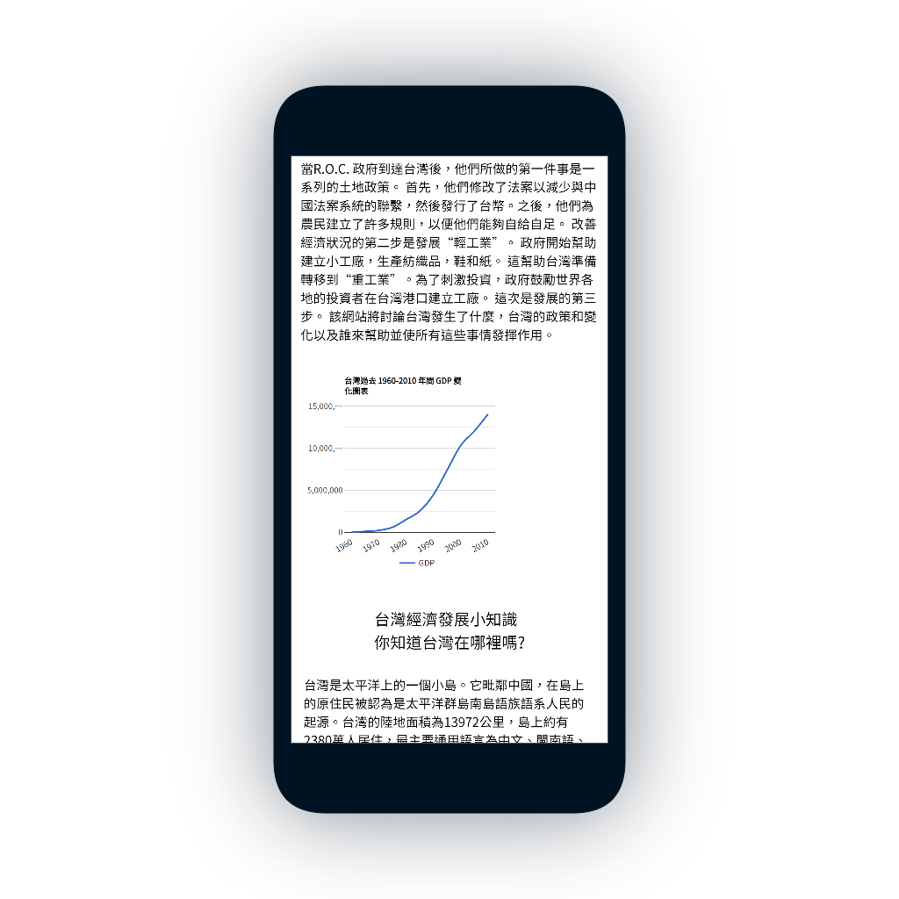
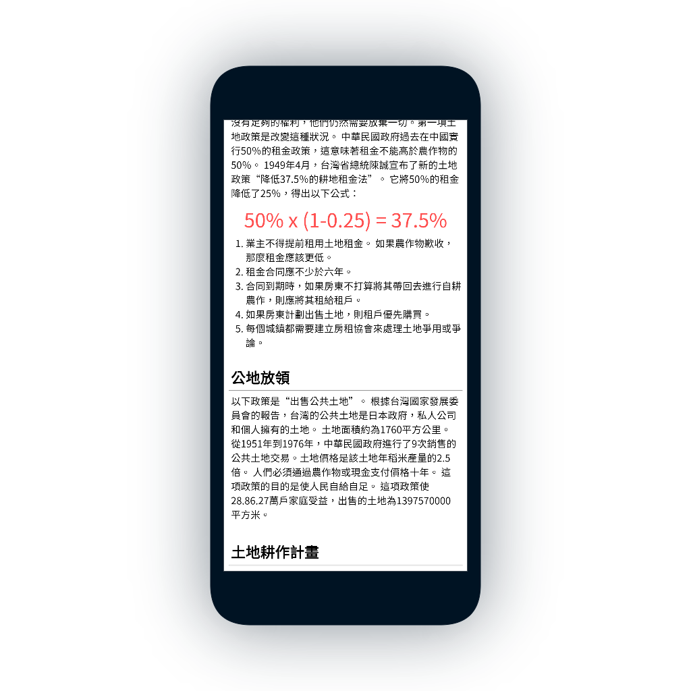
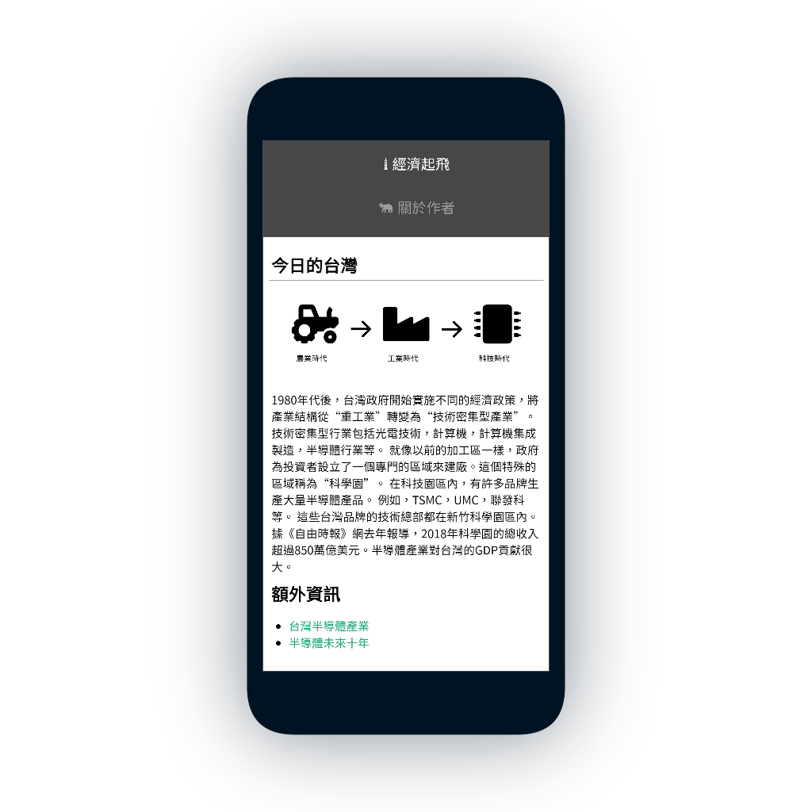

<!--
*** Thanks for checking out the TaiwanEDH. If you have a suggestion
*** that would make this better, please fork the repo and create a pull request
*** or simply open an issue with the tag "enhancement".
*** Thanks again! Now go create something AMAZING! :D
***
*** To avoid retyping too much info. Do a search and replace for the following:
*** github_username (that is "windsuzu"), repo_name (that is "TaiwanEDH"), project_title, project_description
-->

<!-- [![Issues][issues-shield]][issues-url] -->
<!-- [![PR Welcome][pr-welcome-shield]](#contributing) -->
[![Contributors][contributors-shield]][contributors-url]
[![MIT License][license-shield]][license-url]
[![Author][author-shield]][author-url]
[![LinkedIn][linkedin-shield]][linkedin-url]

<!-- PROJECT LOGO -->
 

  

  <h3 align="center">Taiwan EDH</h3>

  

    Taiwan Economic Development History Website.
     
    <a href="https://windsuzu.github.io/TaiwanEDH">View Demo</a>
    ·
    <a href="https://github.com/windsuzu/TaiwanEDH/issues">Report Bug</a>
    ·
    <a href="https://github.com/windsuzu/TaiwanEDH/issues">Request Feature</a>
  

Table of Contents

* [About](#about)
* [Preview](#preview)
  * [Desktop](#desktop)
  * [Smart Phone](#smart-phone)
* [License](#license)
* [Contact](#contact)
* [Acknowledgements](#acknowledgements)

---

<!-- ABOUT THE PROJECT -->
## About

<table>
<tr>
<td>

在 TaiwanEDH 專案中，我們實作了 HTML 5 的架構，還有 CSS 3 的應用。值得一提的實作部分有：

- 設定 `BorderBox` 將內距 (padding) 往元素內推
- 設計 Navigation Bar `<nav>` 的 HTML 架構、 CSS 、 hover 動畫、 active 設定
- 設計 Flex Layout
- 使用 Google Fonts 的字體 
- 使用 Taiwan-font 提供的 Icon 
- 使用 Google Map iframe 顯示台灣地圖 
- 使用 Google Chart 顯示圖表
- 使用 Flex, Media Query 等技術實作響應式 (RWD) 設計  

Built With
* HTML 5
* CSS 3

</td>
</tr>
</table>

---

## Preview

### Desktop

  
  
   
   
  

### Smart Phone

  
  
   
   
  

---
## License

Distributed under the MIT License. See [LICENSE](https://github.com/windsuzu/TaiwanEDH/blob/main/LICENSE) for more information.

## Contact

Reach out to the maintainer at one of the following places:

* [GitHub discussions](https://github.com/windsuzu/TaiwanEDH/discussions)
* The email which is located [in GitHub profile](https://github.com/windsuzu)

## Acknowledgements

* [Wilson Ren](https://www.udemy.com/user/wilson-r-6/)
* [TW Icon Fonts](https://www.twicon.page/index.html)

[contributors-shield]: https://img.shields.io/github/contributors/windsuzu/TaiwanEDH.svg?style=for-the-badge
[contributors-url]: https://github.com/windsuzu/TaiwanEDH/graphs/contributors
[issues-shield]: https://img.shields.io/github/issues/windsuzu/TaiwanEDH.svg?style=for-the-badge
[issues-url]: https://github.com/windsuzu/TaiwanEDH/issues
[license-shield]: https://img.shields.io/github/license/windsuzu/TaiwanEDH.svg?style=for-the-badge&label=license
[license-url]: https://github.com/windsuzu/TaiwanEDH/blob/main/LICENSE
[linkedin-shield]: https://img.shields.io/badge/-LinkedIn-black.svg?style=for-the-badge&logo=linkedin&colorB=555
[linkedin-url]: https://linkedin.com/in/windsuzu
[pr-welcome-shield]: https://shields.io/badge/PRs-Welcome-ff69b4?style=for-the-badge
[author-shield]: https://shields.io/badge/Made_with_%E2%9D%A4_by-windsuzu-F4A92F?style=for-the-badge
[author-url]: https://github.com/windsuzu
